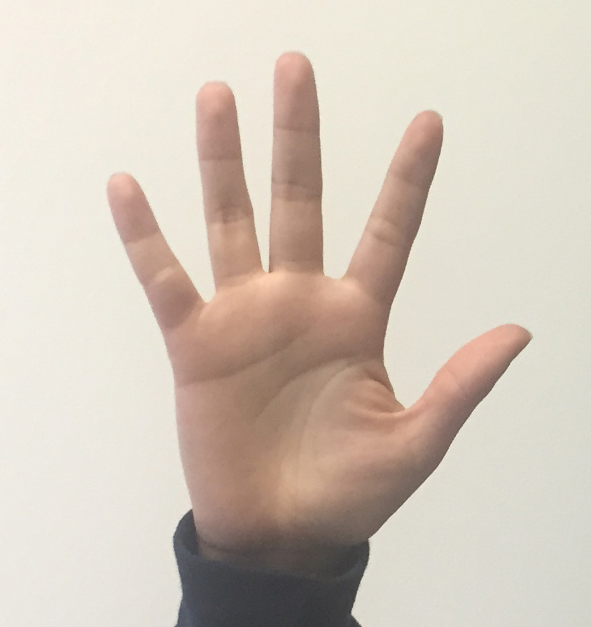
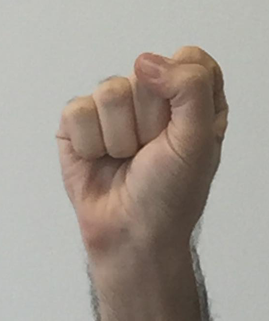
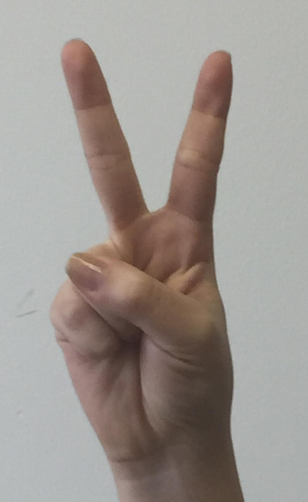
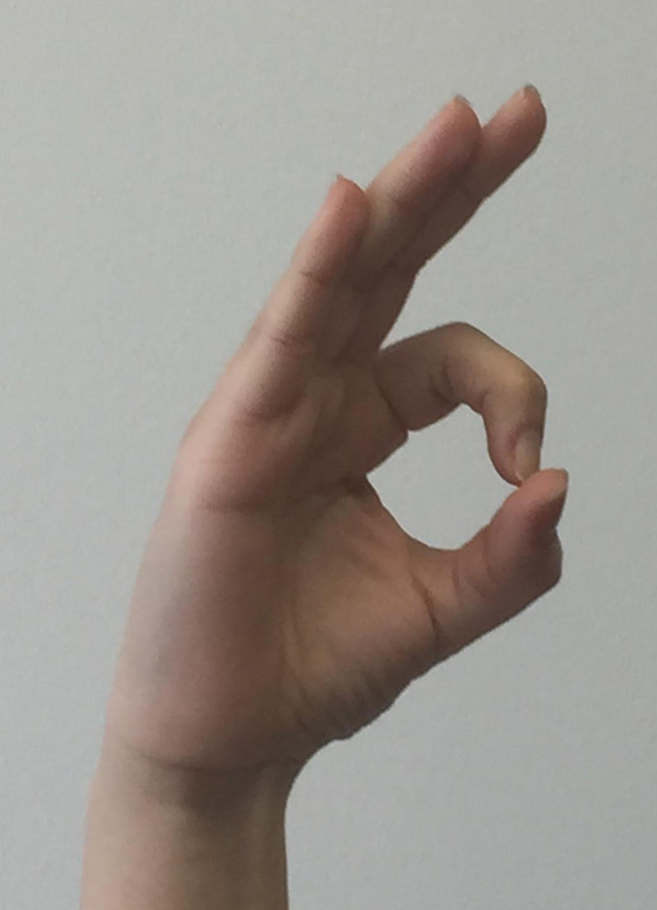
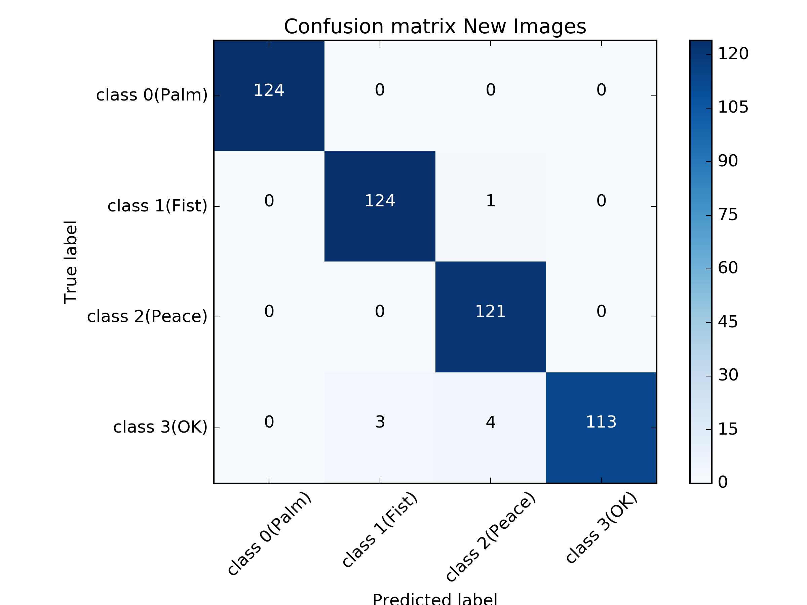
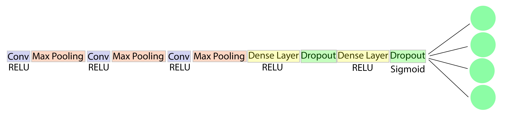

# Hand Gesture Controlled Quadcopter
The purpose of this project was to build a gesture recognition model that is able classify gesture images from the user within 1m to 3m with a white background.

The model was trained on ~4000 gesture images of 10 people from  ~1m to ~3m. 

Example of gesture images, from left to right: gesture 0,1,2,3

   

The final model achieved an accuracy of ~95%.



## Model

~4000 images of 10 users were capture at 640x480p and the hand gesture regions were extracted manually using the "manual_crop_images.py".
To add some variety to the training data, these images were also augmented with shear, vertical flip and rotation.

The model with the following architecture was then trained in batches on these images.



## Getting Started

"keras_training.py" contains the code for training the model and the model architecture itself. 
"Gesture_Images" folder contain the training set.
"Test_Gesture_Images" folder contains the testing set.
"Keras_models" contains the frozen weights of the final model that produced the highest accuracy.
"Captured_Images" is used to save the images captured by the webcam using the "take_picture.py" code.


### Dependencies

```
python 3
scikit-learn 0.19.1
opencv 3.3.0  
Keras 2.0.9
Tensorflow 1.4.0

```

